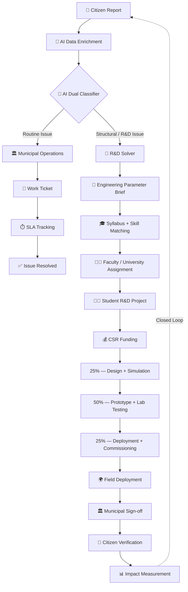

<div align="center">

# 🌍 Civic Innovation Platform

### Turning **Citizen Problems → Engineering Research → Prototypes → Public Impact**

<p>
  <b>A closed-loop civic innovation ecosystem connecting Citizens, Cities, Universities & Corporates.</b>
</p>


<br/>

**Citizen Report → AI Analysis → Municipal Action / R&D → University → CSR → Prototype → Deployment → Impact**

</div>

---

## 💡 What is this?

The **Civic Innovation Platform** is an end-to-end civic problem-solving ecosystem built around a **Quadruple Helix model**:

> 👥 **Citizen + 🏛️ City + 🎓 University + 🏢 Corporate**

Instead of treating every civic complaint as a simple maintenance ticket, the platform introduces an intelligent second pathway for problems that require **engineering redesign, research, prototyping, and deployment**.

The result is a closed loop where a problem reported by a citizen can ultimately become a **real-world engineering project, funded prototype, and measurable community solution**.

---

## ✨ The Big Idea

```text
                    👥 CITIZEN
                       │
                       │ Report
                       ▼
                🤖 AI ANALYSIS
                       │
              ┌────────┴────────┐
              │                 │
         Routine Issue     Structural Issue
              │                 │
              ▼                 ▼
       🏛️ MUNICIPAL          🔬 R&D
         OPERATIONS          PIPELINE
              │                 │
              │                 ▼
              │           🎓 UNIVERSITY
              │                 │
              │                 ▼
              │           💰 CSR FUNDING
              │                 │
              │                 ▼
              │           🧪 PROTOTYPE
              │                 │
              │                 ▼
              └──────────► 🌍 DEPLOYMENT
                                │
                                ▼
                         ❤️ CITIZEN IMPACT
```

**The platform does not stop when the complaint is closed.  
It asks: _Can this problem become an innovation opportunity?_**

---

# 🚀 End-to-End Lifecycle

| # | Stage | What happens |
|---|---|---|
| 01 | 👥 **Citizen Submission** | Citizen submits video, photo, GPS or text |
| 02 | 🤖 **AI Dual Classifier** | Determines operational vs engineering/R&D issue |
| 03 | 🏛️ / 🔬 **Routing** | Sends the issue to municipal operations or R&D |
| 04 | 🎓 **Syllabus Matching** | Finds relevant university course, faculty and skills |
| 05 | 💰 **CSR Grant** | Corporate sponsor funds the selected project |
| 06 | 🧪 **Prototype Build** | Students develop and test the solution |
| 07 | 🌍 **Deployment** | Validated solution is installed in the affected community |
| 08 | 📊 **Impact Verification** | Results are measured and connected back to the citizen |

The attached architecture defines this lifecycle from citizen submission through AI routing, university assignment, CSR funding, prototype development, deployment, and citizen benefit. fileciteturn0file0L9-L16

---

# 🧠 01 — Citizen Ingestion + AI Data Enrichment

A citizen can report a problem using:

- 📹 Short video
- 📸 Photograph
- 📍 GPS location
- 📝 Text description

### Example report

> **"Water stays flooded on the main market road for days."**

The platform can transform this raw report into structured engineering information.

### 🔎 AI + Environmental Enrichment

**Computer Vision**

- Estimate flood depth
- Estimate surface spread
- Use nearby reference objects such as curbs or vehicle tires

**GIS + Weather / Environmental Data**

- Digital Elevation Model (DEM)
- Slope gradient
- Land permeability
- Precipitation rate

These enrichment steps are part of the attached architecture. fileciteturn0file0L18-L24

---

# 🔀 02 — AI Dual-Routing Engine

This is one of the core ideas of the platform.

The system asks:

> **"Does this problem need routine municipal action, or does it need engineering innovation?"**

### 🟢 PATH A — Municipal Operations

Used when the underlying structure is intact but the issue is caused by routine operational problems.

Examples:

- 🗑️ Garbage
- 🪨 Mud
- 🍂 Fallen leaves
- Other maintenance blockages

The platform generates a work ticket and tracks the municipal SLA. Potential receiving departments in the architecture include sanitation, PWD, PHED, water board and lighting. fileciteturn0file0L25-L37

```text
Citizen Report
      ↓
AI Classification
      ↓
Routine Maintenance
      ↓
Municipal Department
      ↓
Work Ticket
      ↓
SLA Tracking
      ↓
✅ Resolution
```

### 🔵 PATH B — R&D + University Pipeline

Used when the problem indicates a structural or recurring engineering limitation.

Examples from the architecture include:

- 📐 Zero / inadequate slope
- 🌊 Recurring overflow
- 📦 Capacity bottleneck

Instead of creating another routine complaint, the platform converts the report into a **quantitative Civil Engineering Parameter Brief**. fileciteturn0file0L38-L46

```text
Citizen Report
      ↓
AI Classification
      ↓
Structural / Engineering Problem
      ↓
Parameter Extraction
      ↓
🔬 R&D Problem Brief
```

---

# 🎓 03 — Syllabus-Wise University Matching

This is where a civic complaint becomes an **academic engineering challenge**.

Universities can provide:

- 📚 Course syllabi
- 🧑‍🏫 Faculty expertise
- 🧪 Laboratory capabilities
- 🎯 Student skill vectors

### Example

```text
Civic Problem
      +
Engineering Parameters
      ↓
Semantic / Vector Matching
      ↓
Relevant Course
      ↓
Faculty / Department
      ↓
Student Project
```

The architecture gives **CE-304: Urban Hydrology & Drainage Design** as an example of a relevant course.

The matched problem can then be presented as a:

- Capstone project
- Laboratory assignment
- Faculty-guided research project

The source architecture identifies course credits, grades and research experience as potential academic incentives. fileciteturn0file0L47-L54

---

# 💰 04 — Corporate CSR + Milestone Governance

The corporate layer provides a potential funding mechanism for university-led civic innovation projects.

The architecture frames this around **Companies Act Section 135 / Schedule VII** and identifies areas such as university technology incubators, environmental sustainability and water-related projects. fileciteturn0file0L55-L58

### 🔐 Milestone-Based Funding

Instead of releasing the entire amount at once:

```text
          💰 CSR FUND
              │
              ▼
        ┌─────────────┐
        │   ESCROW    │
        └──────┬──────┘
               │
       ┌───────┼────────┐
       ▼       ▼        ▼
      25%     50%      25%
       │       │        │
       ▼       ▼        ▼
    Design   Prototype  Deployment
    + Sim.   + Testing  + Sign-off
```

| Gate | Release | Verification |
|---|---:|---|
| 🟡 **Gate 1** | **25%** | CAD design + hydrological simulation approved |
| 🟠 **Gate 2** | **50%** | Physical prototype + laboratory testing verified |
| 🟢 **Gate 3** | **25%** | Field installation + municipal commissioning sign-off |

These three release stages are explicitly described in the architecture. fileciteturn0file0L68-L71

> **Important:** The README describes the proposed architecture. Actual legal, banking, CSR eligibility, escrow and filing workflows would require validation before production deployment.

---

# 🧪 05 — Prototype Development

Once the project is funded, the university/student team develops a physical solution under faculty guidance.

Examples mentioned in the architecture include:

- 🌱 Modular bio-swale filtration unit
- 💧 Micro-detention pit

```text
R&D Problem
    ↓
University Assignment
    ↓
Student Research
    ↓
CAD + Simulation
    ↓
Physical Prototype
    ↓
Laboratory Testing
    ↓
Field Deployment
```

The prototype stage is intended to bridge the gap between **academic research and real infrastructure deployment**. fileciteturn0file0L73-L75

---

# 🌍 06 — Deployment + Citizen Impact

The loop is completed when the validated solution reaches the community.

### 📊 Possible impact dimensions

**⚡ Immediate Relief**

The architecture provides an illustrative target in which water stagnation could fall from **48 hours to under 45 minutes** after heavy rain.

**💼 Economic Yield**

Local self-help groups may gain maintenance-related revenue.

**❤️ Public Health**

The architecture identifies potential reductions in vector-borne disease risks in the affected micro-zone. fileciteturn0file0L73-L79

> These are **architecture examples/target outcomes**, not guaranteed results.

---

# 🏛️ Stakeholder Value

| Stakeholder | Their Role | Value Created |
|---|---|---|
| 👥 **Citizens** | Report problems + verify deployment | Better infrastructure and community outcomes |
| 🏛️ **Municipal Authority** | Handle operational tickets + inspect deployment | Reduced maintenance backlog and access to solutions |
| 🎓 **Students & University** | Research + build prototypes | Real-world experience, academic value and innovation opportunities |
| 🏢 **Corporate Sponsor** | Provide CSR/ESG funding | Verified social/environmental impact and reporting |

This four-stakeholder value loop is summarized in the source architecture. fileciteturn0file0L80-L102

---

# 🏗️ Platform Architecture

```text
┌─────────────────────────────────────────────────────────────┐
│                  🌍 CIVIC INNOVATION PLATFORM               │
├─────────────────────────────────────────────────────────────┤
│                                                             │
│ 👥 CITIZEN LAYER                                           │
│    └── Reports • Media • GPS • Verification                 │
│                                                             │
│ 🤖 INTELLIGENCE LAYER                                      │
│    ├── Computer Vision                                      │
│    ├── AI Classification                                    │
│    ├── Engineering Parameter Extraction                     │
│    └── Syllabus / Skill Matching                            │
│                                                             │
│ 🏛️ MUNICIPAL LAYER                                         │
│    └── Tickets • Departments • SLA • Resolution             │
│                                                             │
│ 🔬 R&D LAYER                                               │
│    └── Problem Brief • Research • Project Tracking          │
│                                                             │
│ 🎓 UNIVERSITY LAYER                                        │
│    └── Courses • Faculty • Students • Labs                  │
│                                                             │
│ 💰 CSR / GOVERNANCE LAYER                                  │
│    └── Sponsors • Grants • Milestones • Audit               │
│                                                             │
│ 🧪 PROTOTYPE LAYER                                         │
│    └── Design • Simulation • Testing                         │
│                                                             │
│ 🌍 DEPLOYMENT + IMPACT LAYER                               │
│    └── Commissioning • Verification • Impact Metrics        │
│                                                             │
└─────────────────────────────────────────────────────────────┘
```

---

# 🔄 Complete System Workflow



---

# 🗃️ Core Data Model

A possible implementation can revolve around these entities:

```text
User
 │
 └── Civic Report
       ├── Media
       ├── Location
       ├── AI Analysis
       └── Engineering Parameters
               │
               ▼
        Routing Decision
          /          \
         /            \
        ▼              ▼
Municipal Ticket     R&D Project
                        │
              ┌─────────┼─────────┐
              ▼         ▼         ▼
          University  Students   Faculty
              │
              ▼
          CSR Grant
              │
              ▼
          Milestones
              │
              ▼
          Prototype
              │
              ▼
          Deployment
              │
              ▼
        Impact Record
```

### Suggested entities

```text
users
citizen_reports
media_assets
locations
ai_analysis
engineering_parameters
municipal_tickets
r_and_d_projects
universities
departments
courses
syllabi
faculty
student_teams
csr_sponsors
csr_grants
milestones
prototype_records
lab_tests
deployments
citizen_verifications
impact_metrics
audit_reports
```

---

# 🧩 Major Modules

| Module | Responsibility |
|---|---|
| 👥 **Citizen Portal** | Submit and track civic reports |
| 🤖 **AI Enrichment Engine** | Analyze media and enrich reports |
| 🔀 **Dual-Routing Engine** | Municipal vs R&D classification |
| 🏛️ **Municipal Module** | Tickets, departments and SLA |
| 🔬 **R&D Solver** | Convert reports into engineering problem briefs |
| 🎓 **University Module** | Courses, faculty, labs and student projects |
| 🧠 **Matching Engine** | Match problems with academic capabilities |
| 💰 **CSR Module** | Sponsors, grants and milestone governance |
| 🧪 **Prototype Module** | Design, testing and project progress |
| 🌍 **Deployment Module** | Installation and commissioning |
| 📊 **Impact Dashboard** | Measure and report community outcomes |

---

# 📁 Suggested Repository Structure

```text
civic-innovation-platform/
│
├── 📁 frontend/
│   ├── citizen-portal/
│   ├── municipal-dashboard/
│   ├── university-dashboard/
│   └── corporate-dashboard/
│
├── 📁 backend/
│   ├── api/
│   ├── authentication/
│   ├── civic-reports/
│   ├── municipal/
│   ├── research/
│   ├── university/
│   ├── csr/
│   ├── prototype/
│   └── impact/
│
├── 📁 ai/
│   ├── computer-vision/
│   ├── classifier/
│   ├── parameter-extraction/
│   └── syllabus-matching/
│
├── 📁 gis/
│   ├── dem/
│   ├── mapping/
│   └── environmental-data/
│
├── 📁 database/
│   ├── schemas/
│   └── migrations/
│
├── 📁 docs/
│   ├── architecture/
│   ├── api/
│   └── research/
│
├── 📁 tests/
│
└── 📄 README.md
```

---

# 🧠 Research & Innovation Areas

### 🤖 Artificial Intelligence

- Computer Vision
- Civic issue classification
- Dual-path routing
- Engineering parameter extraction
- Semantic/vector matching

### 🗺️ Geospatial Intelligence

- GPS-based issue mapping
- DEM integration
- Slope analysis
- Environmental context

### 🏗️ Engineering

- Urban hydrology
- Drainage design
- Infrastructure optimization
- Prototype development
- Field validation

### 🎓 Academic Intelligence

- Syllabus representation
- Course-to-problem matching
- Faculty/skill matching
- Student project assignment

### 💰 CSR + Impact

- Project sponsorship
- Milestone-based funding
- Verification workflows
- Impact measurement
- Audit reporting

---

# 🔐 Governance & Traceability

Because the platform connects citizen reports with public infrastructure, academic work and corporate funding, every major transition should be traceable.

```text
👥 Citizen Report
       ↓
🤖 AI Classification
       ↓
📐 Engineering Validation
       ↓
🎓 Academic Approval
       ↓
💰 Funding Milestone
       ↓
🧪 Prototype Verification
       ↓
🏛️ Municipal Commissioning
       ↓
👥 Citizen Verification
       ↓
📊 Impact Record
```

The architecture also proposes automated generation of **Form CSR-2 Impact Audit Reports** for corporate legal filing. fileciteturn0file0L68-L72

---

# 🎯 Example: From Flooded Road to Innovation

### 📝 Problem

> "The main market road remains flooded for days after rainfall."

### 1️⃣ Citizen Submission

```text
📹 5-second video
📍 GPS location
📝 Text description
```

### 2️⃣ AI Enrichment

Illustrative architecture parameters:

```text
Flood depth      ≈ 0.35 m
Slope            ≈ 0.12%
Permeability     ≈ 0.85
Rainfall         ≈ 45 mm/hr
```

These values come from the example in the architecture and should not be interpreted as universal measurements or thresholds. fileciteturn0file0L18-L24

### 3️⃣ AI Routing

```text
Structural / recurring problem
             ↓
         🔬 R&D PATH
```

### 4️⃣ Engineering Brief

The complaint becomes a structured civil engineering challenge.

### 5️⃣ University Matching

```text
Urban drainage problem
        ↓
CE-304
Urban Hydrology & Drainage Design
        ↓
🎓 Faculty + Student Team
```

The course is used as an example in the source architecture. fileciteturn0file0L47-L52

### 6️⃣ CSR Funding

```text
25% → Design + Simulation
50% → Prototype + Testing
25% → Deployment + Sign-off
```

### 7️⃣ Prototype

Students build and validate the proposed intervention.

### 8️⃣ Deployment

The solution is installed in the affected ward.

### 9️⃣ Impact

The platform records the measurable outcome and connects it back to the original citizen report.

**That is the closed loop. 🔁**

---

# 📊 Impact Philosophy

The project moves civic governance from:

```text
❌ Complaint
      ↓
❌ Ticket
      ↓
❌ Temporary Fix
```

towards:

```text
✅ Citizen Problem
      ↓
🤖 Intelligent Analysis
      ↓
🔬 Engineering Research
      ↓
🎓 Academic Innovation
      ↓
💰 CSR Funding
      ↓
🧪 Prototype
      ↓
🌍 Deployment
      ↓
📊 Measured Impact
      ↓
❤️ Community Benefit
```

---

# 🌱 Why This Architecture is Different

The central idea is **not simply another civic complaint application**.

The differentiating concept is the bridge between:

> **Citizen Problem → Engineering Problem → Academic Research → CSR Funding → Physical Prototype → Municipal Deployment → Measured Citizen Impact**

It connects four traditionally separate ecosystems:

**Civic Governance** × **Higher Education** × **Engineering R&D** × **Corporate CSR**

into a single lifecycle.

---

# 🛠️ Implementation Status

This repository is based on the **Complete End-to-End Civic Innovation Architecture**.

The attached architecture defines the:

- System concept
- Lifecycle
- Stakeholder model
- Routing logic
- University matching concept
- CSR milestone concept
- Prototype/deployment flow
- Impact model

It does **not** prescribe a final:

- Programming language
- Backend framework
- Database
- Cloud provider
- AI model
- GIS provider
- Deployment infrastructure

Therefore, these should be selected during implementation rather than presented as already-defined architectural facts.

---

# 🤝 Contributing

Contributions are welcome in areas such as:

- 🤖 AI-based civic issue classification
- 📸 Computer Vision
- 🗺️ GIS integration
- 📐 Engineering parameter extraction
- 🎓 Syllabus / skill matching
- 🏛️ Municipal workflow automation
- 💰 CSR governance
- 🧪 Prototype tracking
- 📊 Impact measurement
- 🔐 Security and auditability
- 🖥️ Dashboard development

For major architectural changes, open an issue first to discuss the proposed approach.

---

# 👥 Project Team

```text
Project Name : Civic Innovation Platform
Team Name    : <Your Team Name>
Institution  : <Your Institution>

Team Members :
1. <Member 1>
2. <Member 2>
3. <Member 3>
4. <Member 4>

Mentor       : <Mentor Name>
Contact      : <Email / Contact>
```

---

# 📄 License

Add the license selected by the project team.

Example:

```text
MIT License
```

---

<div align="center">

## 🌍 Build for the City. Learn from the Problem. Innovate for the People.

**Turn civic problems into research.  
Turn research into prototypes.  
Turn prototypes into measurable public impact.**

<br/>

⭐ **If this project interests you, consider starring the repository.**

</div>

